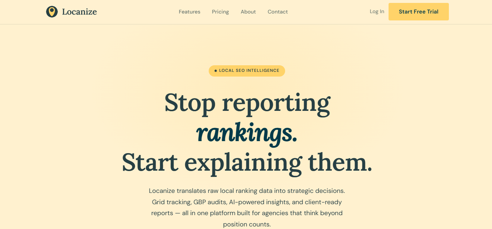
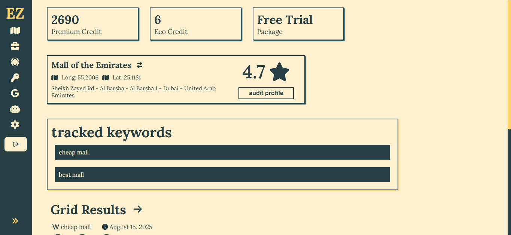
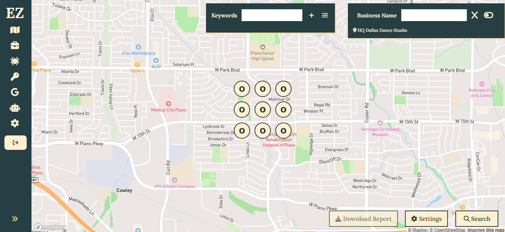
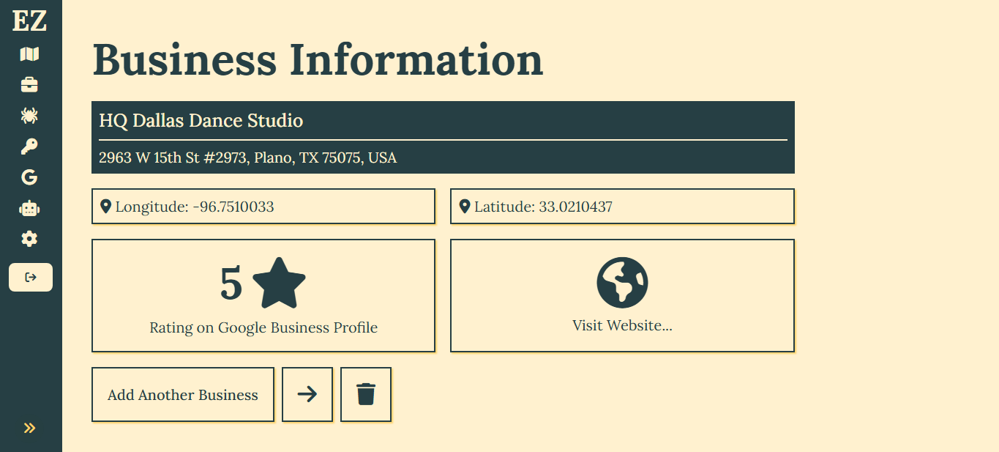
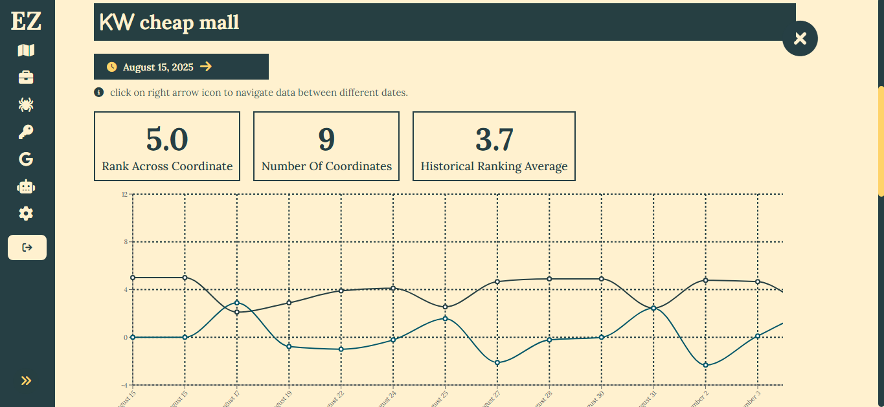
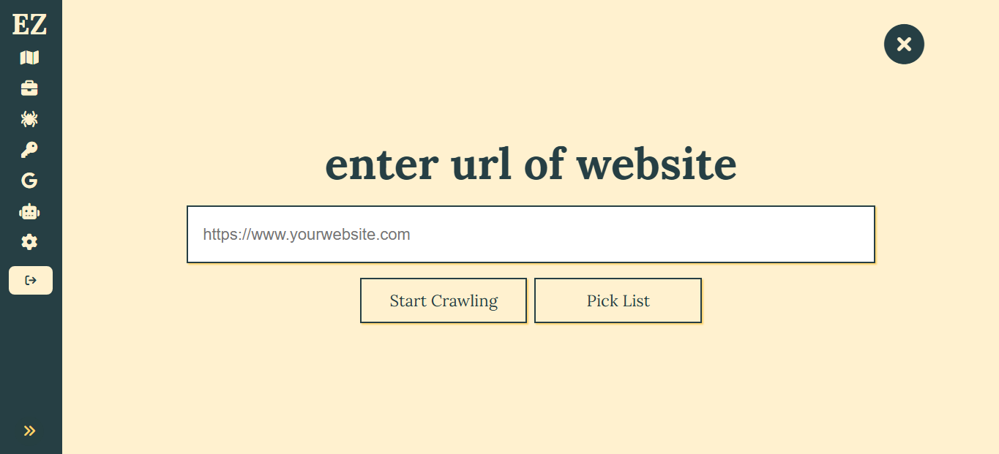
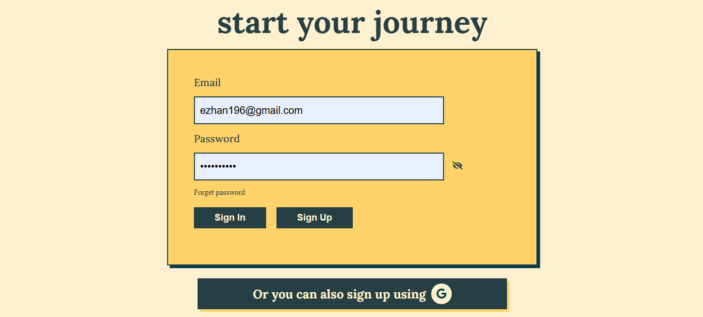
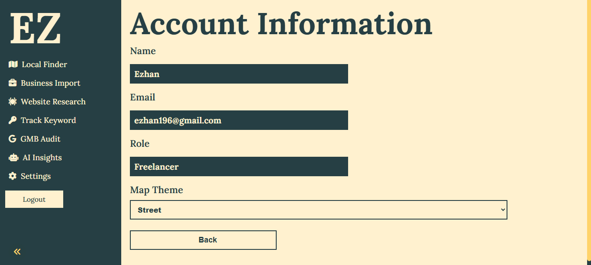

# Locanize

**Local SEO Intelligence for Agencies** — a complete SaaS platform for tracking, auditing, and improving local search visibility, built as an alternative to tools like BrightLocal and Local Falcon.

🔗 [locanize.com](https://www.locanize.com/)

> **Note:** This repository is a portfolio showcase. Locanize's codebase is closed-source / confidential, so this repo documents the product's design, architecture, and functionality instead of containing source code.

---

## What is Locanize?

Locanize helps agencies and local businesses in the U.S. track and improve their presence in local search — covering rank tracking, listing audits, and reporting across their Google Business Profile and local search footprint.

---

## Key Features

<!-- Replace/expand with the actual feature set -->
- **Local rank tracking** — monitor keyword rankings across geo-grids
- **Google Business Profile** — surface issues impacting visibility
- **Keyword Tracking** — benchmark against local competitors
- **Website Crawler** — crawls websites for NLP and keyword research
- **Client Dashboard** — agency-ready reports and dashboards

---

## System Design

### Architecture Overview

- **Frontend:** React, Zustand
- **Backend:** FastAPI, Node, Express
- **Database:** PostgreSQL
- **Background jobs / queues:** Celery, RabbitMQ, Redis
- **Third-party integrations:** Google Business Profile API, Mapbox API, DeepSeek API
- **Infrastructure:** Vercel, Render, Docker

### Key Technical Challenges

- _e.g. Rate-limited, large-scale local rank scraping across geo-grids_
- _e.g. Multi-tenant data isolation for agency clients_
- _e.g. Scheduling and reliability of recurring audit/report jobs_

---

## Tech Stack

| Layer | Technology |
|---|---|
| Frontend | React, Zustand |
| Backend | Node, Express, FastAPI |
| Database | PostgreSQL |
| Infra / DevOps | Docker, Celery, RabbitMQ |
| Payments | Paddle Webhook |

---

## Screenshots

#### Sign Up Page

#### User Settings Page

---

## About This Repo

Locanize is an active commercial product. This repository exists to give recruiters and collaborators visibility into the system's design and functionality without exposing proprietary source code.
